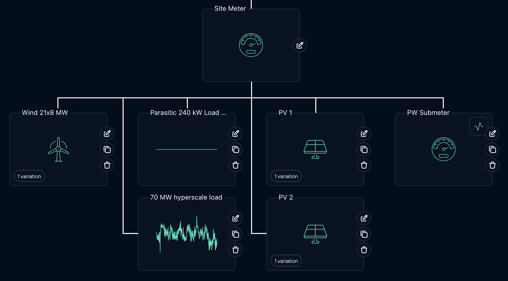

# Wind + Solar + BESS + Private Wire Digital Twin

Digital twin model for sizing battery energy storage systems (BESS) and private wire transmission capacity for renewable energy (wind + solar) serving hyperscale datacenters.


## Overview

This codebase provides:

1. **Datacenter Load Generation**: Realistic 15-minute load profiles for hyperscale datacenters with configurable peaks and capacity factors
2. **BESS Dispatch Optimization**: Convex optimization-based battery dispatch that minimizes curtailment while respecting operational constraints
3. **System Simulation**: Integrated simulation of generation, load, and battery operation over multiple years
4. **Sizing Optimization**: Automated optimization to find optimal BESS and wire sizing that minimizes total system cost

## Key Features

- **Convex optimization** using CVXPY for optimal battery dispatch
- **Realistic constraints**: SoC limits, power limits, daily cycling limits, throughput-based degradation
- **Multi-year simulation** with annual variability and degradation tracking
- **Economic optimization**: Finds optimal sizing based on CAPEX, PPA prices, and revenue
- **Configurable parameters**: All system parameters in YAML configuration file

## Installation

```bash
# Install dependencies
pip install -r requirements.txt
```

## Quick Start

### 1. Data Setup

The system uses simulated 11-year historical wind and solar generation data. Data files should be placed in the `data/` directory:
- `data/wind_generation_11_years_simulated` - Wind generation time series
- `data/solar_generation_11_years_simulated` - Solar generation time series

Alternatively, generate synthetic data for testing:

```bash
python generate_example_data.py --years 10 --wind-capacity 150 --solar-capacity 100
```

### 2. Configure System

Edit `config.yaml` to set your system parameters:

- Generation data paths
- Datacenter load parameters (peak MW, capacity factor)
- BESS parameters (capacity, efficiency, degradation, cycling limits)
- Private wire capacity
- Economic parameters (CAPEX, PPA price)

### 3. Run Simulation

Run a single simulation with current configuration:

```bash
python run_simulation.py --save
```

Or override specific parameters:

```bash
python run_simulation.py --bess-energy 250 --bess-power 75 --wire-capacity 90 --save
```

**Using a pre-generated load profile:**

Instead of generating a new load profile, you can provide an existing CSV file:

```bash
python run_simulation.py --load-csv data/my_load_profile.csv --save
```

**Saving a generated load profile for reuse:**

To save the generated load profile for later use:

```bash
python run_simulation.py --save --save-load-profile
```

This saves the load profile to `outputs/load_profile.csv`, which can be reused in future simulations.

**Running first year only (faster for testing/debugging):**

To speed up simulations during testing or optimization, you can run only the first year:

```bash
# Run simulation for first year only (via command line)
python run_simulation.py --first-year-only --save

# Or with custom parameters
python run_simulation.py --first-year-only --bess-energy 250 --wire-capacity 80 --save
```

Or in Python code:

```python
from src.simulator import SystemSimulator

simulator = SystemSimulator("config.yaml")
results = simulator.run_simulation(
    load_csv_path="data/63_MW_datacenter_load.csv",
    first_year_only=True  # Only simulate first year
)
```

This is particularly useful when iterating on configurations or during optimization, as it can be 5-10x faster than running the full multi-year simulation.

**Running without BESS (for baseline comparisons):**

To simulate the system without battery storage (generation + private wire only):

```bash
# Run simulation without BESS
python run_simulation.py --no-bess --save

# Or with custom wire capacity
python run_simulation.py --no-bess --wire-capacity 80 --save
```

This option skips the BESS dispatch optimization and runs only the stats calculator, allowing you to establish a baseline performance without battery storage. This is useful for:
- Understanding baseline system performance with just generation and private wire
- Comparing scenarios with and without BESS
- Evaluating the value added by battery storage

Results are saved to `outputs/`:
- `timeseries_results.csv`: Full 15-minute time series
- `metrics.yaml`: Summary metrics
- `load_profile.csv`: Load profile (if `--save-load-profile` used)

### 4. Optimize Sizing

Find optimal BESS and wire sizing:

```bash
python optimize_sizing.py
```

This uses optimization to find the combination of:
- BESS energy capacity (MWh)
- BESS power capacity (MW)
- Private wire capacity (MW)

that minimizes net present cost while optionally meeting curtailment and grid import constraints.

**Optimization Configuration:**

Optimization parameters are configured in `optimization_config.yaml`, which includes:
- Optimization method (differential_evolution, nelder-mead, or grid)
- Parameter bounds (min/max values for BESS and wire sizing)
- Constraints (curtailment and grid import limits, can be disabled)
- Algorithm settings (iterations, population size, etc.)
- Penalty values for constraint violations

You can override config values via command-line arguments.

**Optimization options:**

```bash
# Use default settings from optimization_config.yaml
python optimize_sizing.py

# Use custom optimization config file
python optimize_sizing.py --optimization-config my_optimization_config.yaml

# Override method from config
python optimize_sizing.py --method differential_evolution

# Override method (Nelder-Mead: local optimization, faster)
python optimize_sizing.py --method nelder-mead

# Grid search (exhaustive but slow)
python optimize_sizing.py --method grid

# Override constraints from config
python optimize_sizing.py --max-curtailment 0.05 --max-grid-import 0.15

# Run optimization on first year only (much faster)
python optimize_sizing.py --method differential_evolution --first-year-only

# Assume all energy can be sold (sets load to wire capacity)
python optimize_sizing.py --method differential_evolution --assume-all-sellable

# Combine flags for fastest optimization with maximum revenue assumption
python optimize_sizing.py --method differential_evolution --first-year-only --assume-all-sellable
```

The `--first-year-only` flag runs each simulation using only the first year of data, significantly speeding up the optimization process. This is useful for:
- Initial exploration of the design space
- Quick sensitivity analyses
- Testing different optimization strategies

The `--assume-all-sellable` flag assumes all generated energy can be sold by setting the load profile to a constant value equal to the wire capacity. This is useful for:
- Determining maximum revenue potential
- Optimizing for merchant market scenarios where all energy can be sold
- Establishing an upper bound on system economics
- Sizing for maximum energy delivery rather than matching specific load profiles

Once you've identified promising configurations, re-run without `--first-year-only` to verify performance over the full multi-year period.

Results saved to `outputs/optimal_sizing.yaml`.

## Google Colab Notebook

For interactive analysis and client presentations, use the Google Colab notebook:

**Notebook**: `BESS_and_PW_Simulation`

This notebook provides:
- Interactive simulation with no local setup required
- Comprehensive visualizations and analysis
- Side-by-side comparison of No BESS vs. BESS scenarios
- Direct loading of data from Google Drive
- Export results back to Google Drive

### Quick Start with Colab

1. **Upload data to Google Drive** (see [COLAB_QUICKSTART.md](COLAB_QUICKSTART.md))
2. **Open notebook in Colab**: Upload `BESS_and_PW_Simulation.ipynb` to Google Colab
3. **Update GitHub URL** in the first cell to point to your repository
4. **Run all cells** to execute the full simulation and analysis

### What's in the Notebook?

The notebook covers:
1. **Introduction**: Overview of the project and PPA structure
2. **Data Loading**: Connect to Google Drive and load generation data with statistics
3. **CAPEX Configuration**: Override economic parameters interactively
4. **No BESS Simulation**: Baseline scenario without battery storage
5. **BESS Simulation**: Optimized battery dispatch and comparison
6. **Visualizations**: 13 charts showing generation patterns, power flows, energy balance, and BESS performance
7. **Export**: Save results to Google Drive for further analysis

## Project Structure

```
.
├── config.yaml                          # Main system configuration file
├── optimization_config.yaml             # Optimization parameters configuration
├── requirements.txt                     # Python dependencies
├── run_simulation.py                    # Run single simulation
├── optimize_sizing.py                   # Sizing optimization script
├── BESS_and_PW_Simulation.ipynb     # Google Colab notebook for interactive analysis
├── src/
│   ├── load_generator.py                # Datacenter load profile generator
│   ├── aux_load_generator.py            # Auxiliary load profile generator
│   ├── bess_dispatch.py                 # BESS dispatch optimization (CVXPY)
│   └── simulator.py                     # Main simulation engine
├── data/                                # Generation time series (user-provided)
│   ├── wind_generation_11_years.csv
│   ├── solar_generation_11_years.csv
│   └── 63_MW_datacenter_load_11_years.csv
└── outputs/                             # Simulation results
    ├── timeseries_results.csv
    ├── metrics.yaml
    └── optimal_sizing.yaml
```

## Input Data Format

### Generation Data

Wind and solar generation CSV files should have:
- `timestamp`: DateTime column
- First data column: Generation in MW

Example:
```csv
timestamp,wind_mw
2024-01-01 00:00:00,45.2
2024-01-01 00:15:00,47.8
...
```

You can provide your own TMY (Typical Meteorological Year) data or use the synthetic data generator.

### Load Data

If using a pre-generated load profile (via `--load-csv`), the CSV file should have:
- `timestamp`: DateTime column (15-minute resolution)
- `load_mw`: Datacenter load in MW

Example:
```csv
timestamp,load_mw
2024-01-01 00:00:00,85.3
2024-01-01 00:15:00,84.7
2024-01-01 00:30:00,86.1
...
```

**Note:** The load data should cover the same time period as your generation data. The simulator will align the time series by truncating to the shorter length if they differ.

## Configuration

### System Configuration (`config.yaml`)

Key system parameters in `config.yaml`:

#### Datacenter Load
- `annual_peak_mw`: Peak load capacity (MW)
- `capacity_factor`: Annual capacity factor (0-1)
- `base_load_ratio`: Ratio of base load to peak (higher = more stable)
- `random_seed`: Random seed for reproducible load generation

#### BESS
- `energy_capacity_mwh`: Battery size (MWh)
- `power_capacity_mw`: Charge/discharge rate (MW)
- `min_soc` / `max_soc`: Operating range
- `charge_efficiency` / `discharge_efficiency`: One-way efficiencies
- `max_daily_cycles`: Cycling constraint (e.g., 1.5 cycles/day)
- `degradation_per_cycle`: Capacity fade per full cycle

#### Private Wire
- `capacity_mw`: Transmission line capacity

#### Economics
- `ppa_price_eur_per_mwh`: Power purchase agreement price
- `bess_capex_eur_per_mwh`: Battery capital cost (EUR/MWh)
- `wire_capex_eur_per_mw`: EHV transmission line capital cost (EUR/MW)
- `project_lifetime_years`: Project lifetime for NPV calculations
- `discount_rate`: Discount rate for NPV calculations

### Optimization Configuration (`optimization_config.yaml`)

The optimization configuration file controls all parameters for sizing optimization:

#### Method
- `method`: Optimization algorithm to use (`differential_evolution`, `nelder-mead`, or `grid`)

#### Bounds
Define min/max search ranges for each parameter:
- `bess_energy_mwh`: Energy capacity bounds (min, max) in MWh
- `bess_power_mw`: Power capacity bounds (min, max) in MW
- `wire_capacity_mw`: Wire capacity bounds (min, max) in MW

#### Constraints (Optional)
- `max_curtailment_rate`: Maximum allowable curtailment (fraction of generation)
  - Set to `null` or omit to disable this constraint
- `max_grid_import_rate`: Maximum allowable grid import (fraction of load)
  - Set to `null` or omit to disable this constraint

**Important:** When constraints are disabled (set to `null`), the optimization will find the minimum-cost solution without those restrictions.

#### Algorithm Settings
Method-specific parameters:
- **Differential Evolution:**
  - `maxiter`: Maximum generations (default: 50)
  - `popsize`: Population size multiplier (default: 10)
  - `seed`: Random seed for reproducibility
  - `workers`: Number of parallel workers
  - `updating`: Update strategy (`immediate` or `deferred`)
  - `polish`: Apply local optimization to final result

- **Nelder-Mead:**
  - `maxiter`: Maximum iterations (default: 100)

- **Grid Search:**
  - `bess_energy_values`: List of BESS energy values to test
  - `bess_power_values`: List of BESS power values to test
  - `wire_capacity_values`: List of wire capacity values to test

#### Penalties
Multipliers for constraint violation penalties:
- `curtailment_violation`: Penalty for exceeding curtailment limit (default: 1e9)
- `grid_import_violation`: Penalty for exceeding grid import limit (default: 1e9)
- `simulation_failure`: Cost returned for failed simulations (default: 1e12)

#### Display
- `print_header_separator`: Separator string for output formatting
- `show_progress`: Whether to show progress during optimization
- `show_intermediate_results`: Whether to show intermediate results

## BESS Dispatch Algorithm

The battery dispatch uses convex optimization (CVXPY) to:

**Objective:**
- Minimize curtailment (wasted renewable energy)
- Minimize grid import (encourage self-sufficiency)

**Constraints:**
- SoC limits (min/max)
- Power limits (charge/discharge)
- Energy balance (physical battery dynamics)
- Wire capacity limits
- Daily cycling limits (e.g., max 1.5 full cycles per day)

**Strategy:**
- Charge when generation exceeds wire capacity + load
- Discharge when generation is below load (up to wire capacity)
- Respect all physical and operational constraints
- Account for round-trip efficiency and degradation

## Sizing Optimization

The optimizer searches for the best combination of BESS and wire sizing by:

1. **Objective**: Minimize Net Present Cost (NPC)
   - NPC = Total CAPEX - NPV(Revenue from PPA)

2. **Constraints** (optional):
   - Maximum curtailment rate (e.g., 10%) - can be disabled by setting to `null` in config
   - Maximum grid import rate (e.g., 20%) - can be disabled by setting to `null` in config
   - When disabled, the optimization will find the solution that minimizes cost without these constraints

3. **Search space** (configurable in `optimization_config.yaml`):
   - BESS energy: 50-500 MWh (default)
   - BESS power: 20-200 MW (default)
   - Wire capacity: 40-200 MW (default)

4. **Methods**:
   - **Differential Evolution**: Global optimization, robust but slower
   - **Nelder-Mead**: Local optimization, faster but may find local minima
   - **Grid Search**: Exhaustive evaluation, good for visualization

### Optimization Configuration File

The `optimization_config.yaml` file controls all optimization parameters:

**Key sections:**
- `method`: Default optimization method
- `bounds`: Min/max values for BESS energy, BESS power, and wire capacity
- `constraints`: Optional curtailment and grid import constraints
  - Set to `null` or omit to disable a constraint
  - Example: `max_curtailment_rate: null` removes the curtailment constraint
- `algorithm_settings`: Method-specific parameters (iterations, population size, etc.)
- `penalties`: Penalty multipliers for constraint violations
- `display`: Output formatting options

**Disabling Constraints:**

To optimize without constraints, edit `optimization_config.yaml`:

```yaml
constraints:
  max_curtailment_rate: null  # No curtailment constraint
  max_grid_import_rate: null  # No grid import constraint
```

Or override via command line:
```bash
# This maintains constraints from config for curtailment but changes grid import
python optimize_sizing.py --max-grid-import 0.25
```

**Note:** Command-line arguments always override values in the config file.

## Example Workflow

### Basic Workflow

```bash
# 1. Ensure 10 years of real data is available in data/ directory
# (Or generate synthetic data for testing: python generate_example_data.py --years 10)

# 2. Test with default configuration
python run_simulation.py --save

# 3. Optimize sizing
python optimize_sizing.py --method differential_evolution --max-curtailment 0.08

# 4. Re-run with optimal parameters
# (Update config.yaml with optimal values, or use command line)
python run_simulation.py --bess-energy 275 --bess-power 68 --wire-capacity 85 --save
```

### Workflow with Pre-Generated Load Profile

```bash
# 1. Generate and save a load profile once
python run_simulation.py --save --save-load-profile

# 2. Reuse the saved load profile for testing different configurations
# This ensures consistent load assumptions across runs
python run_simulation.py --load-csv outputs/load_profile.csv --bess-energy 300 --save

# 3. Compare results with different wire capacities using the same load
python run_simulation.py --load-csv outputs/load_profile.csv --wire-capacity 90 --save
```

## Metrics Output

Simulation produces comprehensive metrics:

**Energy Flows:**
- Total generation, load, curtailment, grid import
- Wire delivery to datacenter

**Utilization:**
- Renewable fraction (% of load served by renewables)
- Curtailment rate (% of generation wasted)
- Grid import rate (% of load from grid)
- Wire utilization (average usage vs capacity)

**BESS Performance:**
- Total cycles over project lifetime
- Round-trip efficiency
- Cumulative degradation

**Economics:**
- CAPEX (BESS + wire)
- Revenue (PPA * delivered energy)
- Simple payback period
- Net present cost

## Customization

### Using Your Own Generation Data

Replace the synthetic data with your own TMY data:

1. Prepare CSV files with columns: `timestamp`, `generation_mw`
2. Update paths in `config.yaml`:
   ```yaml
   generation_data:
     wind_file: "path/to/your/wind_data.csv"
     solar_file: "path/to/your/solar_data.csv"
   ```

### Modifying BESS Dispatch Strategy

Edit `src/bess_dispatch.py` to customize:
- Objective function weights
- Additional constraints
- Different optimization solvers

### Custom Optimization Objectives

Edit `optimize_sizing.py` to optimize for:
- LCOE (Levelized Cost of Energy)
- IRR (Internal Rate of Return)
- Capacity factor maximization
- Other custom metrics

## Technical Details

### Optimization Solver

Uses **CVXPY** with ECOS solver for convex optimization. Key advantages:
- Guaranteed global optimum (for convex problems)
- Fast and reliable
- Handles large-scale problems (35,000+ timesteps)

### Performance

- Single simulation (~10 years, 15-min): ~5-15 seconds
- Single simulation (first year only): ~1-3 seconds
- Full sizing optimization: ~10-60 minutes (depending on method)
- Sizing optimization (first year only): ~2-10 minutes (5-10x faster)
- Memory usage: <2 GB for typical problem sizes

### Limitations

- Assumes perfect forecast (not a real-time dispatch model)
- Simplified degradation model (throughput-based only)
- No BESS power electronics losses beyond round-trip efficiency
- No grid connection costs or tariffs (private wire only)

## License

MIT License.

## Support

For questions or issues, contact Valuestack at quote@valuestack.info.
